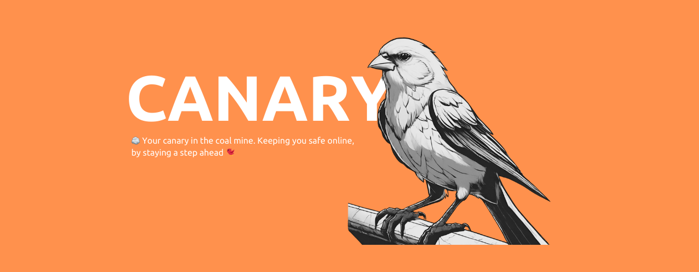

    
  </a>

<b>
 🪨 Your canary in the coal mine. Keeping you safe online, by staying a step ahead 🐦 
</b>

 

 

Canary is a Chrome extension that uses the Google Vertex AI to scan the websites you visit for extremist content and block them!

# Examples
<table>
  <tr>
    <td></td>
    <td></td>
    <td></td>
  </tr>
</table>

# 🙏 Contributions
DIS{integrity} is an open-source project and welcomes contributions from the community. If you would like to contribute to DIS{integrity}, please follow these guidelines:

- Fork the repository to your own GitHub account.
- Create a new branch with a descriptive name for your contribution.
- Make your changes and test them thoroughly.
- Submit a pull request to the main repository, including a detailed description of your changes and any relevant documentation.
- Wait for feedback from the maintainers and address any comments or suggestions (if any).
- Once your changes have been reviewed and approved, they will be merged into the main repository.

# ⚖️ Code of Conduct
DIS{integrity} follows the Contributor Covenant Code of Conduct. Please make sure [to review](https://www.contributor-covenant.org/version/2/1/code_of_conduct/code_of_conduct.md). and adhere to this code of conduct when contributing to DIS{integrity}.

# 🐛 Bug Reports and Feature Requests
If you encounter a bug or have a suggestion for a new feature, please open an issue in the GitHub repository. Please provide as much detail as possible, including steps to reproduce the issue or a clear description of the proposed feature. Your feedback is valuable and will help improve DIS{integrity} for everyone.

# 💛 Thanks
This tool wouldn't work without [APKTool](https://ibotpeaches.github.io/Apktool/documentation/)! 

# 📜 License
[GNU General Public License v3.0](https://choosealicense.com/licenses/gpl-3.0/)
